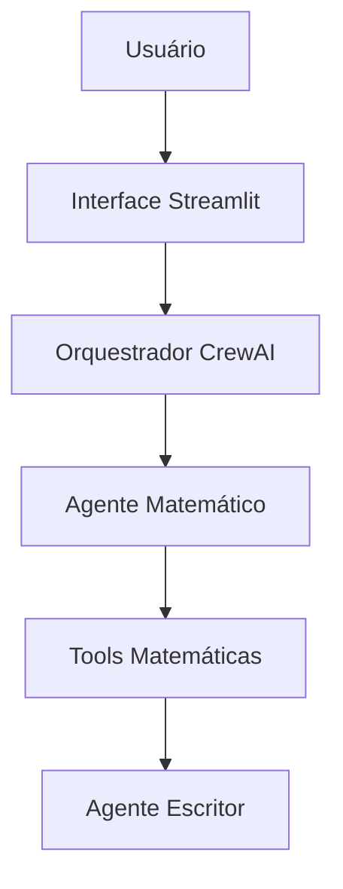

# 🤖 Chatbot Multi-Agente de Orquestração Sequencial

Este projeto consiste em um **Chatbot inteligente e resiliente** desenvolvido com **Streamlit** e **CrewAI**. A aplicação demonstra a orquestração estruturada de múltiplos agentes de IA especializados, o uso de ferramentas Python como fonte única da verdade e a aplicação rigorosa de memória contextual, guardrails e testes automatizados.

---

## 🎯 Objetivo

Resolver o problema clássico de alucinação de modelos de linguagem em operações matemáticas, garantindo que todos os cálculos sejam executados por ferramentas determinísticas e não pelo LLM.

---

## ✨ Funcionalidades

- Operações matemáticas exatas (soma, subtração, multiplicação e divisão)
- Arquitetura multiagente com CrewAI
- Memória contextual de curto prazo
- Guardrails de entrada via Regex
- Validações robustas com tratamento de exceções
- Logs estruturados para auditoria
- Testes automatizados com Pytest
- Interface web utilizando Streamlit

---

## 🏗️ Arquitetura



### Fluxo

1. O usuário envia uma solicitação.
2. O Streamlit realiza validações iniciais.
3. O CrewAI coordena os agentes.
4. O Agente Matemático identifica a operação necessária.
5. As Tools executam o cálculo real.
6. O Agente Escritor converte o resultado em uma resposta amigável.
7. O resultado é devolvido ao usuário.

---

## 📁 Estrutura do Projeto

```text
chat-bot-task/
│
├── app.py
├── agents_config.py
├── tools.py
├── requirements.txt
├── app.log
├── README.md
│
└── tests/
    └── test_tools.py
```

---

## 🛠️ Tecnologias Utilizadas

| Tecnologia | Finalidade |
|------------|------------|
| Python 3.12 | Linguagem principal |
| Streamlit | Interface Web |
| CrewAI | Orquestração multiagente |
| Groq | Inferência LLM |
| Llama 3.3 70B | Modelo de linguagem |
| Pytest | Testes automatizados |

---

## 🧠 Memória Contextual

O histórico da conversa é armazenado através do `st.session_state.messages`.

Exemplo:

```python
historico_formatado = ""

for msg in st.session_state.messages[:-1]:
    autor = "Usuário" if msg["role"] == "user" else "Assistente"
    historico_formatado += f"{autor}: {msg['content']}\n"
```

Isso permite interações encadeadas como:

```text
Usuário: Quanto é 5 + 4?
Assistente: 9

Usuário: Agora multiplique por 2
Assistente: 18
```

---

## 🔒 Guardrails

### Front-end

Validação por expressões regulares para impedir entradas inválidas.

Exemplo:

```text
5 + batata
```

### Back-end

- Conversão explícita de tipos
- Tratamento de exceções
- Restrições de prompt
- Rejeição de operações sem dados numéricos válidos

---

## 🚀 Instalação

### 1. Clonar o projeto

```bash
git clone https://github.com/eriklegramante-dev/chat-bot-task.git
cd chat-bot-task
```

### 2. Criar ambiente virtual

#### Linux/macOS

```bash
python3 -m venv venv
source venv/bin/activate
```

#### Windows

```bash
python -m venv venv
venv\Scripts\activate
```

### 3. Instalar dependências

```bash
pip install -r requirements.txt
```

### 4. Configurar variáveis de ambiente

Crie um arquivo `.env`:

```env
GROQ_API_KEY=sua_chave_aqui
```

### 5. Executar aplicação

```bash
streamlit run app.py
```

A aplicação ficará disponível em:

```text
http://localhost:8501
```

---

## 🧪 Testes

Executar:

```bash
pytest tests/test_tools.py
```

Saída esperada:

```text
collected 5 items

tests/test_tools.py ..... [100%]

5 passed
```

---

## 📊 Critérios de Aceitação

- [x] Chatbot funcional via Streamlit
- [x] Operações matemáticas exatas
- [x] Uso exclusivo de Tools para cálculos
- [x] Orquestração multiagente com CrewAI
- [x] Memória contextual funcional
- [x] Guardrails implementados
- [x] Logs estruturados
- [x] Testes automatizados

---

## 📄 Licença

Este projeto está licenciado sob a licença MIT.
