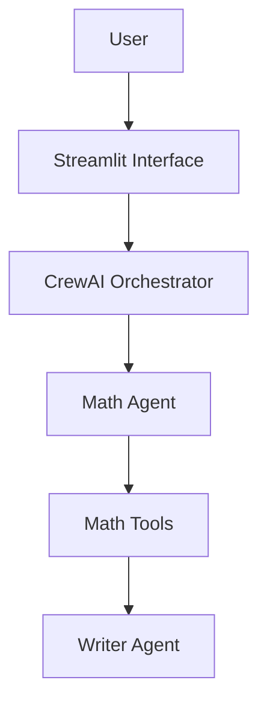

# 🤖 Multi-Agent Sequential Orchestration Chatbot

This project is an **intelligent and resilient chatbot** built with **Streamlit** and **CrewAI**. The application demonstrates structured orchestration of multiple specialized AI agents, the use of Python tools as the single source of truth, and the implementation of contextual memory, guardrails, and automated testing.

---

## 🎯 Objective

Solve the classic problem of language model hallucinations in mathematical operations by ensuring that all calculations are executed through deterministic tools rather than the LLM itself.

---

## ✨ Features

- Exact mathematical operations (addition, subtraction, multiplication, and division)
- Multi-agent architecture powered by CrewAI
- Short-term contextual memory
- Input guardrails using Regex validation
- Robust exception handling and validation
- Structured logging for auditing and debugging
- Automated testing with Pytest
- Web interface built with Streamlit

---

## 🏗️ Architecture



### Workflow

1. The user submits a request.
2. Streamlit performs initial validation.
3. CrewAI orchestrates the agents.
4. The Math Agent identifies the required operation.
5. Mathematical Tools execute the actual calculation.
6. The Writer Agent converts the result into a user-friendly response.
7. The response is returned to the user.

---

## 📁 Project Structure

```text
chat-bot-task/
│
├── app.py
├── agents_config.py
├── tools.py
├── requirements.txt
├── app.log
├── README.md
│
└── tests/
    └── test_tools.py
```

---

## 🛠️ Technologies Used

| Technology | Purpose |
|------------|----------|
| Python 3.12 | Main programming language |
| Streamlit | Web interface |
| CrewAI | Multi-agent orchestration |
| Groq | LLM inference |
| Llama 3.3 70B | Language model |
| Pytest | Automated testing |

---

## 🧠 Contextual Memory

Conversation history is stored using `st.session_state.messages`.

Example:

```python
historico_formatado = ""

for msg in st.session_state.messages[:-1]:
    author = "User" if msg["role"] == "user" else "Assistant"
    historico_formatado += f"{author}: {msg['content']}\n"
```

This enables follow-up interactions such as:

```text
User: What is 5 + 4?
Assistant: 9

User: Now multiply it by 2
Assistant: 18
```

---

## 🔒 Guardrails

### Front-End

Regex validation prevents invalid inputs.

Example:

```text
5 + potato
```

### Back-End

- Explicit type conversion
- Exception handling
- Prompt restrictions
- Rejection of operations without valid numeric inputs

---

## 🚀 Installation

### 1. Clone the Repository

```bash
git clone https://github.com/eriklegramante-dev/chat-bot-task.git
cd chat-bot-task
```

### 2. Create a Virtual Environment

#### Linux/macOS

```bash
python3 -m venv venv
source venv/bin/activate
```

#### Windows

```bash
python -m venv venv
venv\Scripts\activate
```

### 3. Install Dependencies

```bash
pip install -r requirements.txt
```

### 4. Configure Environment Variables

Create a `.env` file:

```env
GROQ_API_KEY=your_api_key_here
```

### 5. Run the Application

```bash
streamlit run app.py
```

The application will be available at:

```text
http://localhost:8501
```

---

## 🧪 Testing

Run:

```bash
pytest tests/test_tools.py
```

Expected output:

```text
collected 5 items

tests/test_tools.py ..... [100%]

5 passed
```

---

## 📊 Acceptance Criteria

- [x] Chatbot runs successfully with Streamlit
- [x] Exact mathematical operations
- [x] Calculations performed exclusively through Tools
- [x] Multi-agent orchestration with CrewAI
- [x] Functional contextual memory
- [x] Guardrails implemented
- [x] Structured logging
- [x] Automated testing

---

## 🚀 Roadmap

- [ ] Database persistence
- [ ] Docker support
- [ ] Long-term memory
- [ ] RAG integration
- [ ] Langfuse observability
- [ ] Additional tool integrations

---

## 📄 License

This project is licensed under the MIT License.
